# COMP7250 Report: Bag of Tricks
24435015 He Rui

## 1. Introduction

Training deep convolutional neural networks usually takes a lot of time. Although many optimization methods have been suggested to speed up training, some of them do not work well and some may even make training slower or reduce model performance.

In this project, several practical optimization methods was applied to reduce training time while keeping the model accuracy as high as possible.

## 2. Problem Definition

Given the CIFAR-10 dataset and a standard ResNet18 architecture, this project aimed to reduce training time while maintaining model performance. 

All experiments were conducted on a **single GPU (1 × RTX 3070 × 16GB VRAM, 16 vCPUs × 31GB RAM)**, rented from [RunPod.io](https://www.runpod.io/).

The following metrics were used to evaluate performance: **Training time**, **Validation accuracy**, **Validation loss**.

## 3. Methodology

**Baseline Setup**

I trained **ResNet18** on the **CIFAR-10** dataset with a batch size of 32, 2 workers, a maximum of 100 epochs, early stopping enabled with 10 epochs patience. 

All other hyperparameters were left as **PyTorch defaults**.

This project used **PyTorch Lightning** to streamline training and log metrics.

| Trick                                  | Value                                               |
| -------------------------------------- | --------------------------------------------------- |
| `batch_size`                           | `[32, 64, 128, 256]`                                |
| `num_worker`                           | `[2, 4, 8, 12]`                                     |
| `pin_memory`                           | `[False, True]`                                     |
| `label_smoothing`                      | `[0.0, 0.05, 0.1, 0.2]`                             |
| `channels_last`                        | `[False, True]`                                     |
| `precision`                            | `16-mixed`, `bf16-mixed`, `32-true`                 |
| `torch.compile`                        | `default`, `reduce-overhead`, `max-autotune`, `off` |
| `torch.set_float32_matmul_precision()` | `high`, `medium`, `highest`                         |

**Only one trick was appleid at a time**.
## 4 Results

### 4.1 Batch Size

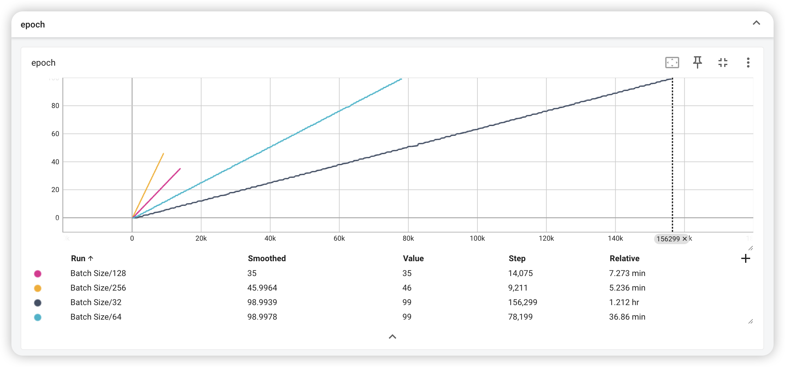
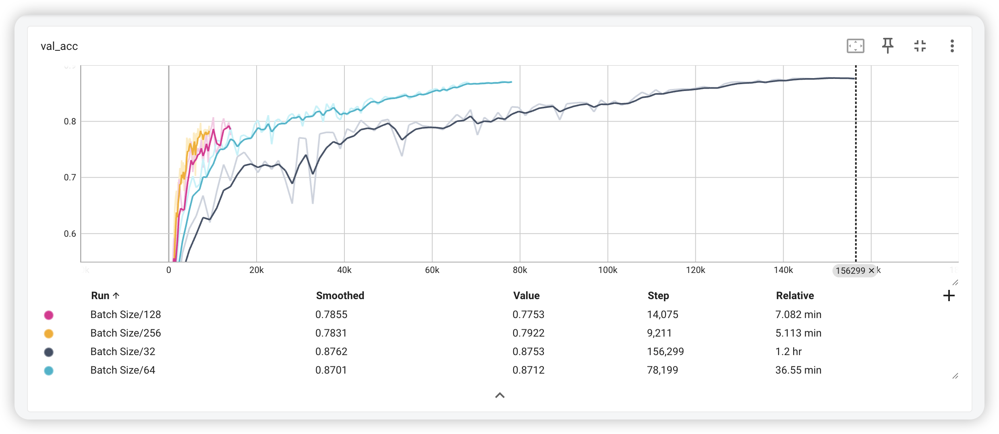

* Batch Size 32 achieved the highest **val acc (0.8753)** but required 1.2 hours to complete.
* Larger sizes (256) trained much faster (**~5 minutes**) but resulted in 10% lower accuracy.
* Size 64 performed similarly to 32 (0.8753 vs 0.8712), but required only half the training time.

### 4.2 Number of Workers
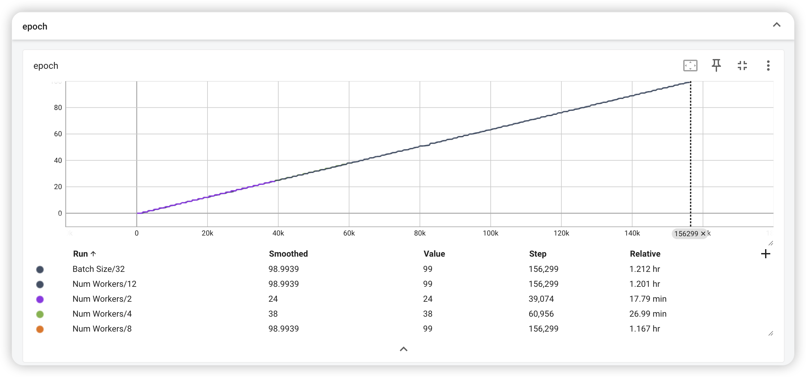
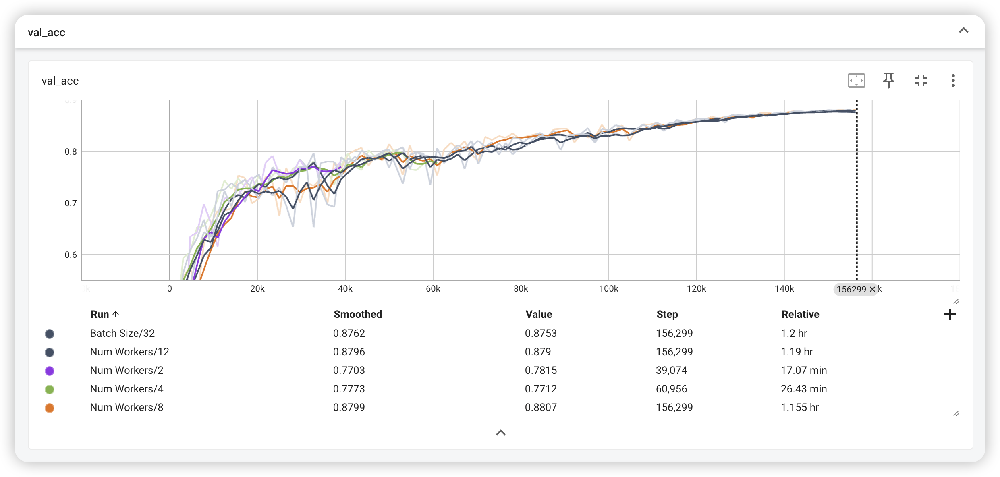

* Setting num_workers=8 and 12 achieved near-identical and optimal validation accuracy.
* Their training times were 1.155 hours and 1.19 hours, respectively, both faster than the baseline with batch_size=32 and default num_workers=2.
* The slight increase in time from 8 to 12 workers suggests that excessive process switching may have led to performance degradation.

> In the results, I observed that num_workers=2 and num_workers=4 triggered early stopping, causing training to terminate at **24** and **38** epochs respectively, which was well before the maximum limit of 100 epochs. As a result, the models were likely undertrained.
>
> Therefore, these two settings (num_workers=2 and 4) were excluded from the final performance comparison, since early stopping distorted their results.
>
> To prevent this issue, the early stopping patience could be increased from **10 to 20**, but due to time constraints, this adjustment was not applied and the experiments were not rerun.

### 4.3 Pin Memory

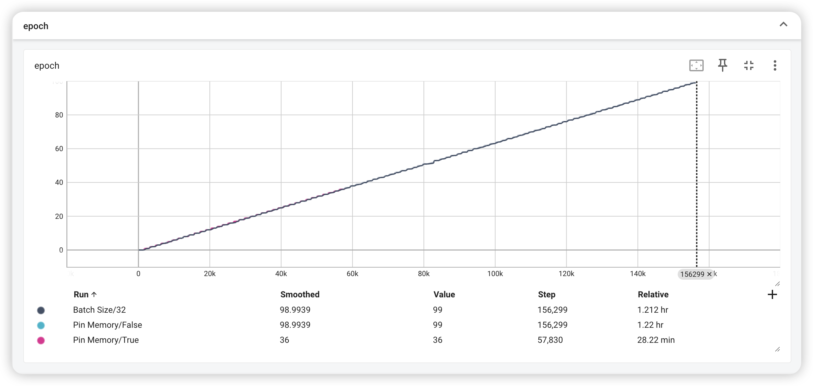
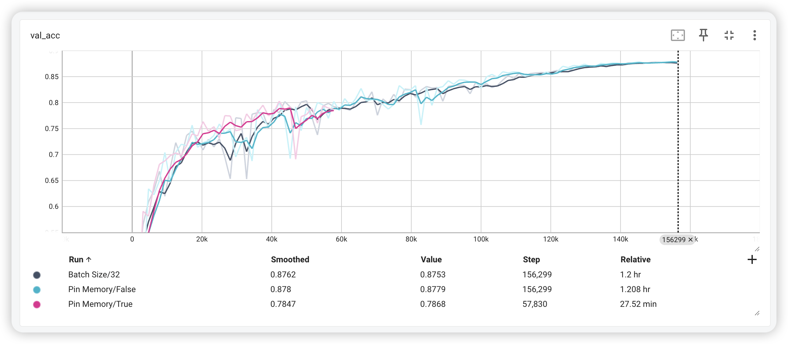

* Early stopping was triggered when pin_memory=True, so the result may not so convincing.  
* However, based on the observed trend, it can be reasonably inferred that there would **not be a significant difference** between pin_memory=True and False in terms of performance.

### 4.4 LabelSmoothing
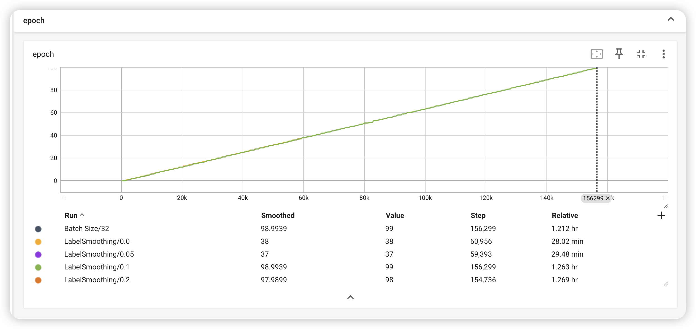
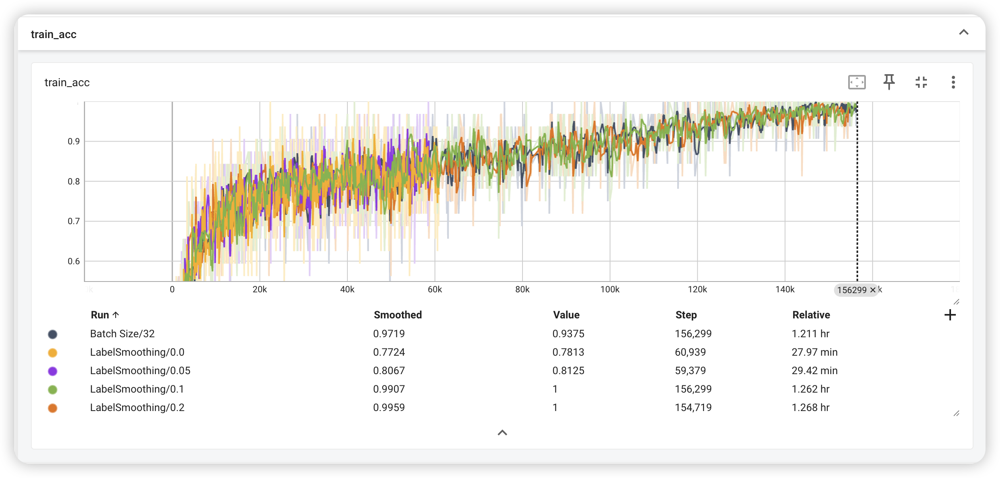
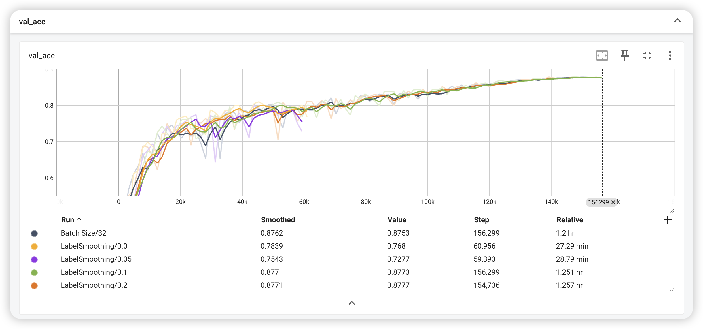

* Both LabelSmoothing=0.1 and 0.2 achieved near-perfect training accuracy, but resulted in similar validation accuracy compared to the baseline (without label smoothing).
* This suggests that for the CIFAR-10 classification task, label smoothing may not provide significant benefits.

### 4.5 ChannelsLast
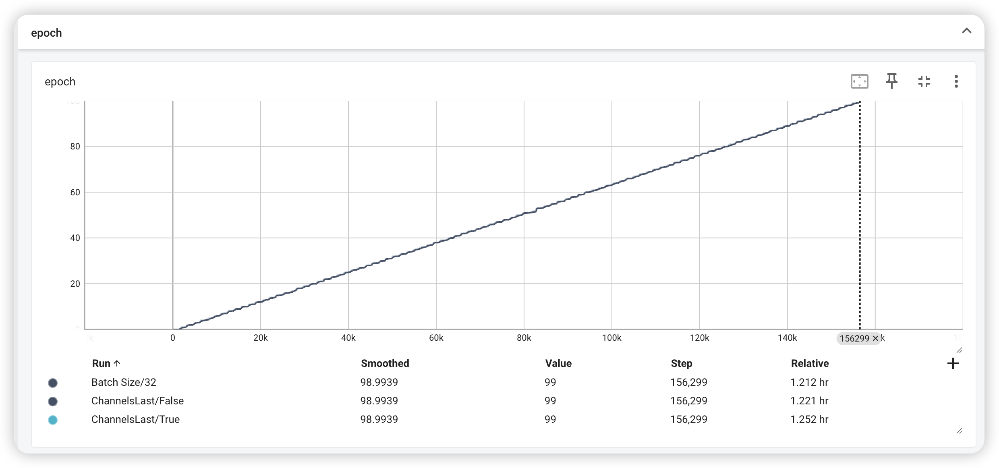
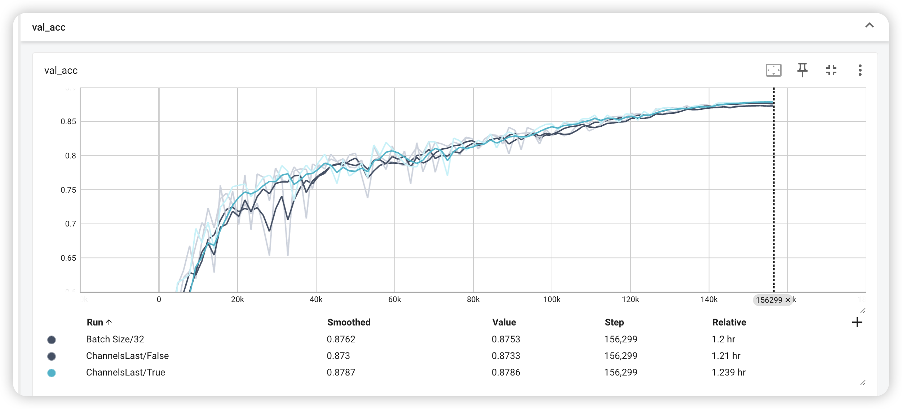

* Setting channels_last=True resulted in approximately the same training time as the default channels_last=False (**1.239 hours vs 1.21 hours**), with nearly identical accuracy.
* Although channels_last=True is often recommended to accelerate training with Tensor Cores, in this case it did not lead to a significant improvement.
* This suggests that channels_last, when used without additional kernel-level optimizations, may offer limited benefits or even cause slight performance degradation on  GPUs like RTX 3070.

### 4.6 Precision
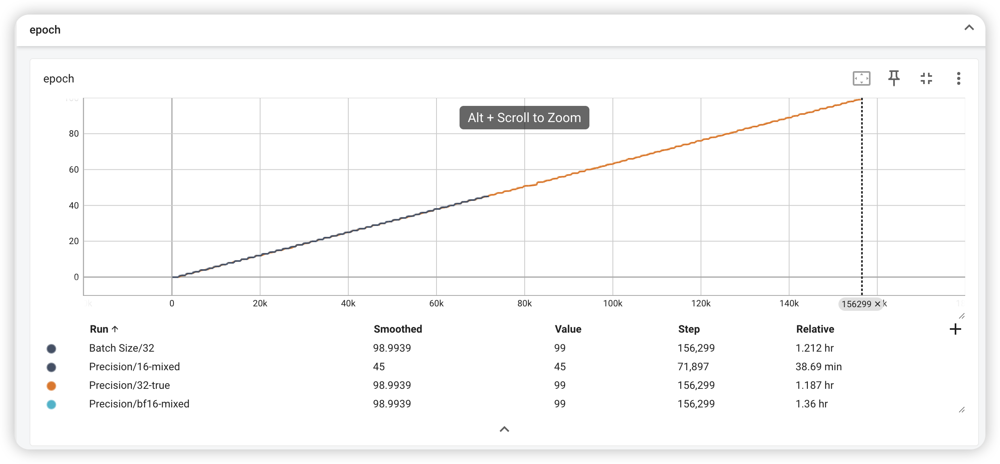
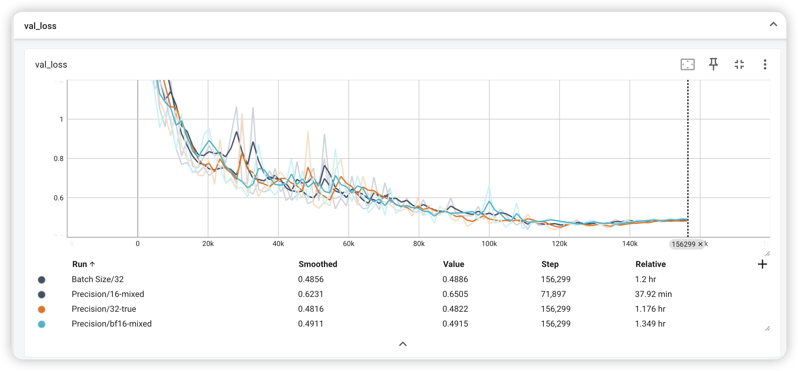

* Compared Batch Size=32 under Precision=32-true and Precision=bf16-mixed settings.
* bf16-mixed achieved approximately the same accuracy as 32-true, but resulted in 14.6% longer training time.
* This suggests that on GPUs like RTX 3070, bf16-mixed may not offer performance benefits, and may even increase training time.

### 4.7 MatmulPrecision

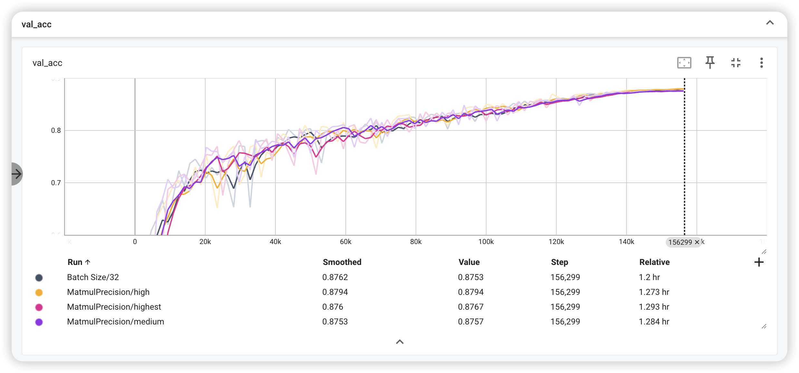

* The results show that different matmul precision settings have no significant impact on validation accuracy, and the training time differences are also minimal.

### 4.8 TorchCompile
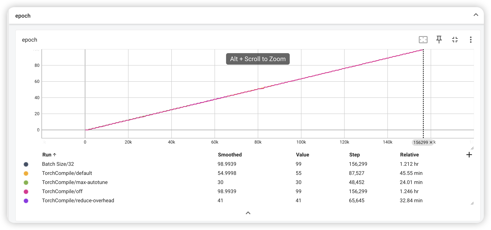
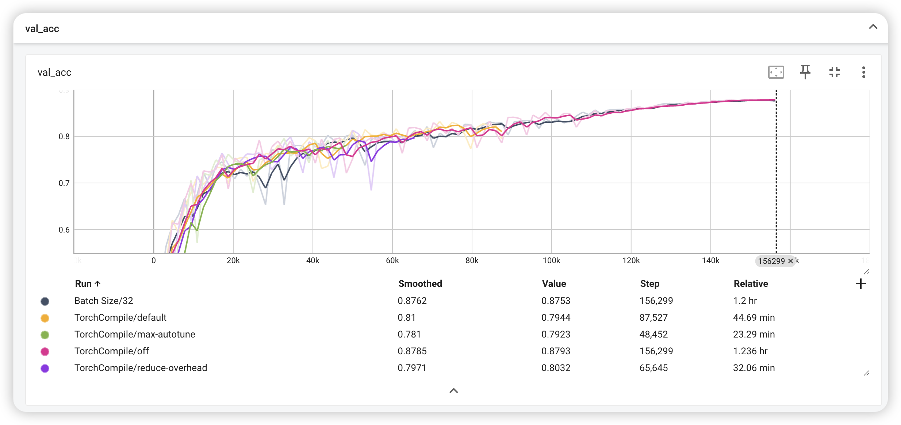

TorchCompile/default, max-autotune, and reduce-overhead runs were terminated early due to early stopping, so the results may not be entirely conclusive. However, I  believe that meaningful insights can still be drawn by analyzing the training and validation trends.
* max-autotune reached a low training loss of 0.45 within 48k steps, indicating faster convergence.
* All three settings showed steadily increasing validation accuracy, and reduce-overhead achieved the highest validation accuracy early, and the trend suggests it had not yet plateaued.
* Based on these observations, max-autotune appears to provide benefits in this setting.

## Conclusion

1.	Batch size has the **most significant** impact on the experiments, affecting both validation accuracy and training time. The difference is substantial (e.g., approximately **1 hour vs. 30 minutes**), making it the most critical factor.
2.	Precision settings do not affect the final validation performance, but they have a noticeable impact on training time. In some cases, such as bf16-mixed, the training time is even longer, suggesting a potential negative impact.
3.	Pin memory, label smoothing, channels_last, and matmul precision have relatively limited effects under the current experimental setup. No significant performance gains were observed.
4.	Due to early stopping in TorchCompile configurations, no definitive conclusions can be drawn, but training trends suggest that max-autotune may offer faster convergence and is worth further investigation.

## References

* [PyTorch Lightning](https://lightning.ai/docs/pytorch/stable/)
* [PyTorch Performance Tuning Guide](https://pytorch.org/tutorials/recipes/recipes/tuning_guide.html)
* [Torch Compile](https://pytorch.org/docs/stable/generated/torch.compile.html)

## Implementation
This project was implemented in Python 3.12 and used PyTorch and PyTorch Lightning, all code was developed by me.

ChatGPT-4o was used to enhance the readability when writing this report.